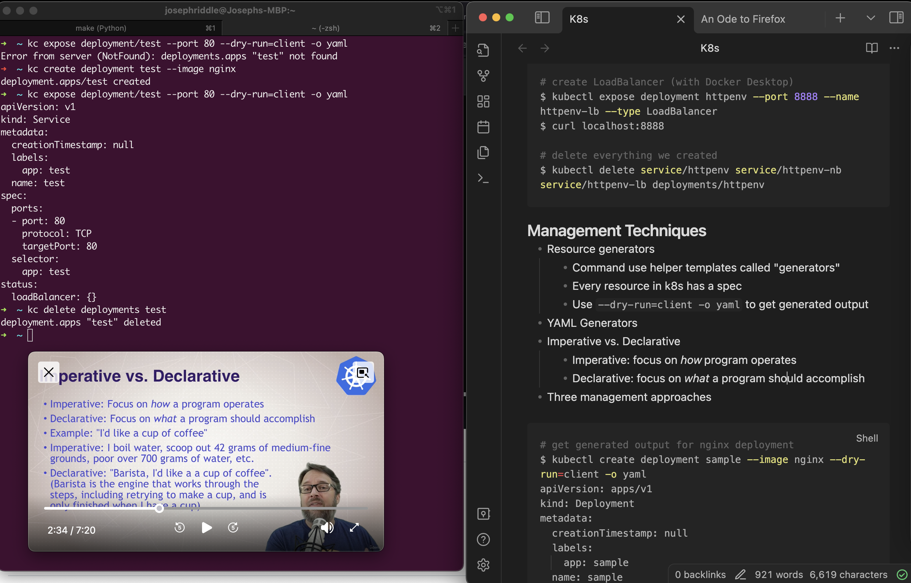

+++
title = 'An Ode to Firefox'
date = 2024-02-13T19:36:35-08:00
+++

I've used Firefox as my daily driver for web browsing for several years now. I don't remember exactly when or why I made the switch from Chrome, but it was probably in the hacker spirit.

Having used Firefox for the last few years, it's hard to imagine using any other browser day-to-day, even [Arc](https://arc.net/) which seems to be the new hotness. I'm tempted to play with [Ladybird](https://awesomekling.github.io/Ladybird-a-new-cross-platform-browser-project/), but that's more from a technical interest than anything

Here are some of the features of Firefox that I would find it hard to live without, in no particular order:

- [Picture-in-Picture](#picture-in-picture)
- [Screenshots of Regions](#screenshots-of-regions)
- [Multi-Account Containers](#multi-account-containers)
- [uBlock Origin](#ublock-origin)

---

### Picture-in-Picture

[Picture-in-Picture](https://support.mozilla.org/en-US/kb/about-picture-picture-firefox) (PiP) let's you watch almost any video in a box that can be overlayed and moved anywhere on your screen. It's perfect for coding while following along a video or when you're working on something on a single monitor and only need to reference the video occasionally. Today I used PiP to watch a Udemy Kubernetes course while I had a terminal and Obsidian open, all on a single screen:

I typically activate PiP by hovering over a video and clicking the PiP icon. After reading the docs while writing this post, I've discovered you can also activate it by clicking an icon in the address bar or right clicking the video.

### Screenshots of Regions

Firefox's built-in screenshot tool allows for some really cool web-based screenshots.

You can take a screenshot of a specific HTML element by hovering over it. This is way better than trying to perfectly snip the element using screenshot tools built in to the operating system.



and the resulting screenshot:



You can also take a screenshot of the full height of a web page by clicking "Save full page". This works _most_ of the time, but can occasionally crash on really large pages.



### Multi-Account Containers

If you've used [Chrome with multiple profiles](https://support.google.com/chrome/answer/2364824), [Firefox Multi-Account Containers](https://support.mozilla.org/en-US/kb/containers) isn't far off. With MCA, you configure multiple containers that provide separate contexts per container. If you login to a website in one container and open that same website in another container, you won't be logged in. This is useful if you have multiple logins for the same website, like Outlook or Gmail. This is _especially_ useful when you work with multiple customers for work. This extension also pairs well with the [Facebook Container](https://support.mozilla.org/en-US/kb/facebook-container-prevent-facebook-tracking) extension.

### uBlock Origin

It's hard to imagine browsing the modern web without an adblocker like uBlock Origin. While this one isn't necessarily unique to Firefox, I've seen a [few](https://www.theverge.com/2023/11/16/23964509/google-manifest-v3-rollout-ad-blockers) [articles](https://www.theverge.com/2022/6/10/23131029/mozilla-ad-blocking-firefox-google-chrome-privacy-manifest-v3-web-request) that [talk](https://9to5google.com/2023/11/16/chrome-extensions-disabled/) about how Chrome's Manifest v3 handicaps adblockers:

> For compatibility reasons, Mozilla will still use most of the Manifest V3 spec in Firefox so that extensions can be ported over from Chrome with minimal changes. But, crucially, Firefox will continue to support blocking through Web Request after Google phases it out, enabling the most sophisticated anti-tracking ad blockers to function as normal.

There is a newer [uBlock Origin Lite](https://chromewebstore.google.com/detail/ublock-origin-lite/ddkjiahejlhfcafbddmgiahcphecmpfh) extension for Chrome, but from my understanding, it is far less powerful than the non-Lite version. From this [reddit comment](https://www.reddit.com/r/uBlockOrigin/comments/1067als/comment/j3h00xj) about the Lite version:

> - Filter lists update only when the extension updates (no fetching up to date lists from servers)
> - Many filters are dropped at conversion time due to MV3's limited filter syntax
> - No crafting your own filters (thus no element picker)
> - No strict-blocked pages
> - No per-site switches
> - No dynamic filtering
> - No importing external lists

---

There you have it, folks! Those are some of the features that I love about Firefox! 🦊 
